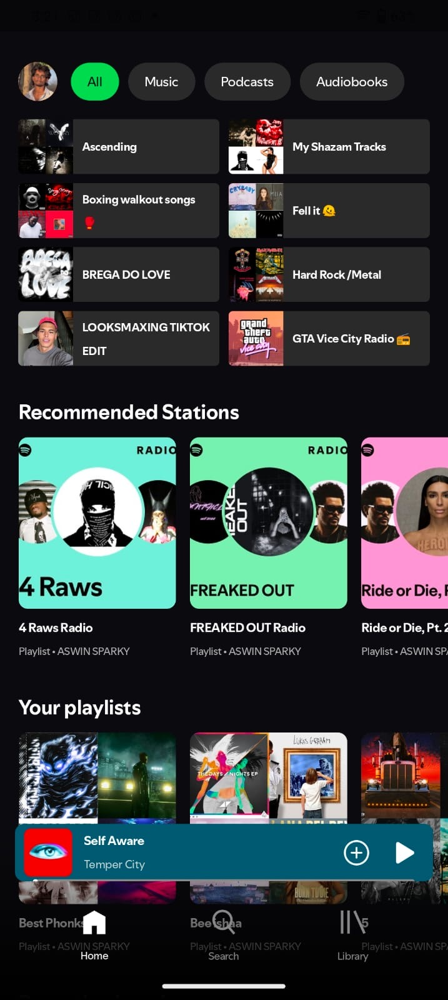
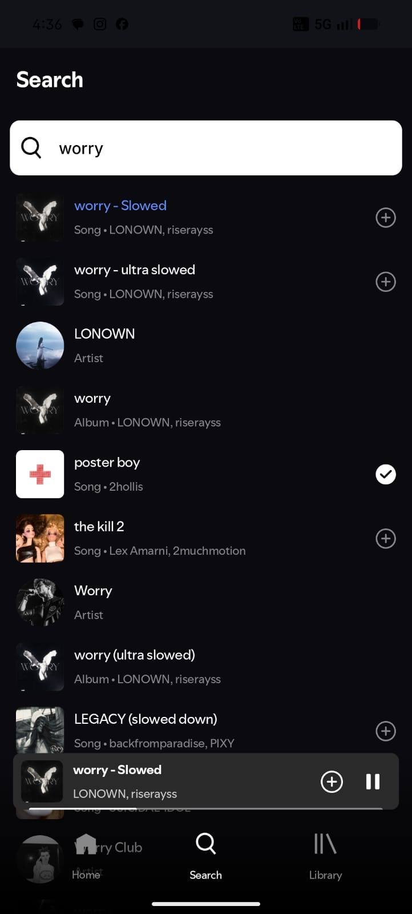
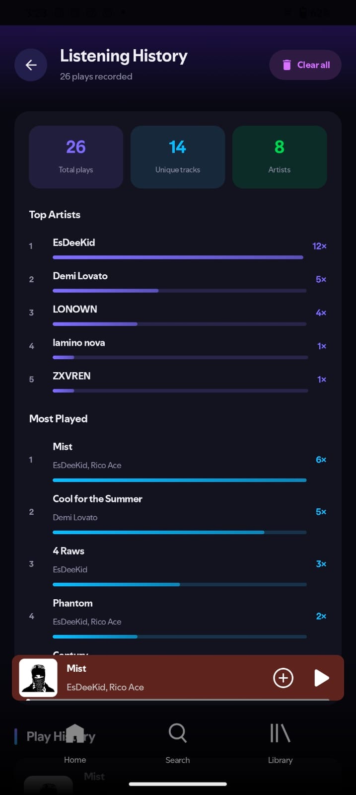
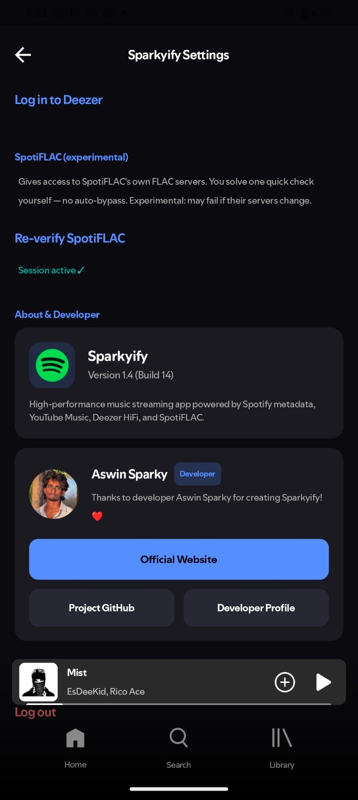

<div align="center">

# 🎵 Sparkyify

### A modern Spotify-inspired music player for Android, built with Jetpack Compose.

<p>
  <strong>Browse your Spotify library • Multi-source playback • Synced lyrics • Lossless audio • Dynamic UI</strong>
</p>

<p>
  
  
  
  
</p>

</div>

---

## 📖 About

**Sparkyify** is a modern Android music player inspired by the Spotify experience and built entirely with **Kotlin** and **Jetpack Compose**.

The application integrates with Spotify for music metadata and library information while providing a flexible playback system capable of sourcing audio from multiple platforms and local files.

Sparkyify focuses on providing a smooth, modern music experience with features such as synchronized lyrics, dynamic album-art theming, lossless audio playback, crossfade transitions, and DJ-style audio processing.

> **Note:** Sparkyify is an independent project and is not affiliated with, authorized by, maintained by, sponsored by, or endorsed by Spotify AB or any of its affiliates.

---

## ✨ Features

### 🎧 Spotify Integration

* Sync your Spotify library.
* Browse saved playlists.
* Browse liked songs.
* Browse saved albums.
* Browse followed artists.
* Access Spotify-based music metadata.
* Track radio and autoplay functionality.
* Create and manage playlists.
* Add or remove tracks from your library.

### 🎶 Advanced Playback

* Multi-source audio playback.
* Spotify metadata with alternative audio sources.
* YouTube Music integration.
* Deezer integration.
* Local audio file playback.
* Lossless FLAC playback.
* SpotiFLAC integration.
* Background playback.
* Media controls.
* Crossfade support.
* DJ-style audio transitions.
* Custom audio processing using a Biquad filter pipeline.

### 🎤 Synced Lyrics

* Real-time synchronized lyrics.
* Full-screen lyrics experience.
* Lyrics synchronized with the current playback position.
* Lyrics available directly from the player interface.

### 🎨 Modern UI

* Built entirely with **Jetpack Compose**.
* Smooth animations and transitions.
* Responsive Android interface.
* Dynamic Now Playing screen.
* Album-art-based dynamic colors.
* Modern music-player experience.

---

## 📸 Screenshots

> Replace the following images with screenshots from your actual application.

|                                 Home                                 |                                  Search                                  |                                  History                                  |                                   Settings                                  |
| :------------------------------------------------------------------: | :---------------------------------------------------------------------------: | :----------------------------------------------------------------------: | :------------------------------------------------------------------------: |
|  |  |  |  |

---

## 🏗️ Architecture

Sparkyify follows a modern Android architecture and is built around Kotlin, Jetpack Compose, reactive data streams, and Media3.

### Project Modules

```text
Sparkyify/
├── build.gradle.kts
├── settings.gradle.kts
├── gradle.properties
├── local.properties
├── gradlew / gradlew.bat
├── README.md
├── LICENSE
│
├── assets/
│   ├── screenshot-home.png
│   ├── screenshot-history.png
│   ├── screenshot-settings.png
│   └── screenshot-search.png
│
├── gradle/
│   ├── libs.versions.toml
│   └── wrapper/
│       ├── gradle-wrapper.jar
│       └── gradle-wrapper.properties
│
├── app/
│   ├── build.gradle.kts
│   ├── proguard-rules.pro
│   └── src/
│       ├── test/java/com/music/spotui/
│       │   └── ExampleUnitTest.kt
│       └── main/
│           ├── AndroidManifest.xml
│           ├── ic_launcher-playstore.png
│           ├── assets/
│           │   ├── player_configs.json
│           │   ├── po_token.html
│           │   └── silent.mp3
│           ├── res/
│           │   ├── drawable/               # Icons, vectors, splash, and cover art
│           │   ├── font/                   # Spotify Mix UI fonts & Montserrat
│           │   ├── mipmap-*/               # Launcher icons
│           │   ├── values/                 # colors.xml, strings.xml, themes.xml
│           │   └── xml/                    # automotive_app_desc.xml, backup_rules.xml, etc.
│           └── java/
│               ├── com/music/sparkyify/
│               │   ├── MainActivity.kt
│               │   ├── MyApplication.kt
│               │   ├── App.kt
│               │   │
│               │   ├── audio/
│               │   │   ├── BiquadFilter.kt
│               │   │   └── CrossfadeFilterAudioProcessor.kt
│               │   │
│               │   ├── playback/
│               │   │   └── ChunkedDataSource.kt
│               │   │
│               │   ├── lossless/
│               │   │   ├── LosslessSource.kt
│               │   │   ├── LosslessRegistry.kt
│               │   │   └── SpotiflacGated.kt
│               │   │
│               │   ├── deezer/
│               │   │   ├── DeezerCrypto.kt
│               │   │   ├── DeezerDataSource.kt
│               │   │   ├── DeezerSession.kt
│               │   │   └── DeezerSource.kt
│               │   │
│               │   ├── di/
│               │   │   ├── AppModule.kt
│               │   │   ├── CurrentSongState.kt
│               │   │   ├── Palette.kt
│               │   │   ├── SongPlayer.kt
│               │   │   └── SpotifyWebPlayer.kt
│               │   │
│               │   ├── data/
│               │   │   ├── api/
│               │   │   │   ├── Api.kt
│               │   │   │   ├── BrowseTileImages.kt
│               │   │   │   ├── LyricsApi.kt
│               │   │   │   ├── ProfileCache.kt
│               │   │   │   ├── Response.kt
│               │   │   │   ├── SpotifySession.kt
│               │   │   │   ├── SpotifySync.kt
│               │   │   │   └── SpotifyTokenProvider.kt
│               │   │   ├── entity/
│               │   │   │   ├── AccountModel.kt
│               │   │   │   ├── AlbumsModel.kt
│               │   │   │   ├── ArtistOverviewModel.kt
│               │   │   │   ├── ArtistsModel.kt
│               │   │   │   ├── HomeFeedModel.kt
│               │   │   │   ├── LibraryEntry.kt
│               │   │   │   ├── Lyrics.kt
│               │   │   │   ├── PodcastModel.kt
│               │   │   │   ├── SearchResults.kt
│               │   │   │   └── SongsModel.kt
│               │   │   ├── local/
│               │   │   │   └── LocalImport.kt
│               │   │   ├── preferences/
│               │   │   │   ├── AlternativeStreamPref.kt
│               │   │   │   ├── DeezerPref.kt
│               │   │   │   ├── DownloadPref.kt
│               │   │   │   ├── FollowedArtistPref.kt
│               │   │   │   ├── LibraryCachePref.kt
│               │   │   │   ├── LikedAlbumPref.kt
│               │   │   │   ├── LikedSongPref.kt
│               │   │   │   ├── ListeningHistoryPref.kt
│               │   │   │   ├── LocalLibraryPref.kt
│               │   │   │   ├── MusicSourcePref.kt
│               │   │   │   ├── PlaybackStatePref.kt
│               │   │   │   ├── RecentItemsPref.kt
│               │   │   │   ├── SettingsPref.kt
│               │   │   │   └── SpotiflacSessionPref.kt
│               │   │   ├── recommendation/
│               │   │   │   └── SpotifyRecommendationEngine.kt
│               │   │   └── update/
│               │   │       └── UpdateChecker.kt
│               │   │
│               │   └── ui/
│               │       ├── components/
│               │       │   ├── AppComponents.kt
│               │       │   ├── LikedSongsAlbum.kt
│               │       │   ├── SavedInSheet.kt
│               │       │   ├── SongOptionsSheet.kt
│               │       │   └── UpdatePrompt.kt
│               │       ├── navigation/
│               │       │   ├── MainBottomNavigation.kt
│               │       │   ├── MyNavHost.kt
│               │       │   └── Routes.kt
│               │       ├── notification/
│               │       │   ├── MusicPlayerController.kt
│               │       │   ├── PlaybackService.kt
│               │       │   └── WebMediaPlayer.kt
│               │       ├── repository/
│               │       │   └── AppRepository.kt
│               │       ├── screens/
│               │       │   ├── AlbumScreen.kt
│               │       │   ├── ArtistScreen.kt
│               │       │   ├── CategoryScreen.kt
│               │       │   ├── DeezerIntroScreen.kt
│               │       │   ├── DeezerLoginScreen.kt
│               │       │   ├── DownloadsScreen.kt
│               │       │   ├── HistoryScreen.kt
│               │       │   ├── HomeScreen.kt
│               │       │   ├── LibraryScreeen.kt
│               │       │   ├── LikedSongsScreen.kt
│               │       │   ├── LocalFilesScreen.kt
│               │       │   ├── LyricsScreen.kt
│               │       │   ├── MusicSourceScreen.kt
│               │       │   ├── PlayerScreen.kt
│               │       │   ├── PlaylistScreen.kt
│               │       │   ├── QueueScreen.kt
│               │       │   ├── SearchScreen.kt
│               │       │   ├── SettingsScreen.kt
│               │       │   ├── ShowScreen.kt
│               │       │   ├── SpotiflacVerifyScreen.kt
│               │       │   ├── SpotifyLoginScreen.kt
│               │       │   └── YouTubeLoginScreen.kt
│               │       ├── theme/
│               │       │   ├── Color.kt
│               │       │   ├── Theme.kt
│               │       │   └── Type.kt
│               │       └── viewmodel/
│               │           ├── AlbumViewModel.kt
│               │           ├── ArtistViewModel.kt
│               │           ├── CategoryViewModel.kt
│               │           ├── HomeViewModel.kt
│               │           ├── LibraryViewModel.kt
│               │           ├── LikedSongsViewModel.kt
│               │           ├── LyricsViewModel.kt
│               │           ├── PlayerViewModel.kt
│               │           ├── PlaylistViewModel.kt
│               │           ├── SearchViewModel.kt
│               │           └── ShowViewModel.kt
│               │
│               └── com/metrolist/music/
│                   ├── constants/
│                   │   └── AudioQuality.kt
│                   └── utils/
│                       ├── Utils.kt
│                       ├── YTPlayerUtils.kt
│                       ├── cipher/
│                       │   ├── CipherDeobfuscator.kt
│                       │   ├── CipherWebView.kt
│                       │   ├── FunctionNameExtractor.kt
│                       │   ├── PlayerConfigParser.kt
│                       │   ├── PlayerConfigStore.kt
│                       │   ├── PlayerDatesStore.kt
│                       │   ├── PlayerJsFetcher.kt
│                       │   └── RendererRecoveryPolicy.kt
│                       ├── potoken/
│                       │   ├── JavaScriptUtil.kt
│                       │   ├── PoTokenException.kt
│                       │   ├── PoTokenGenerator.kt
│                       │   ├── PoTokenResult.kt
│                       │   └── PoTokenWebView.kt
│                       └── sabr/
│                           ├── EjsNTransformSolver.kt
│                           └── SabrException.kt
│
├── spotify/
│   ├── build.gradle.kts
│   └── src/
│       ├── test/kotlin/com/metrolist/spotify/
│       │   ├── SpotifyMapperMatchScoreTest.kt
│       │   └── SpotifyMapperPerformanceTest.kt
│       └── main/kotlin/com/metrolist/spotify/
│           ├── SpotiFlac.kt
│           ├── Spotify.kt
│           ├── SpotifyAuth.kt
│           ├── SpotifyCanvas.kt
│           ├── SpotifyHashProvider.kt
│           ├── SpotifyMapper.kt
│           └── models/
│               ├── SpotifyAlbum.kt
│               ├── SpotifyArtist.kt
│               ├── SpotifyError.kt
│               ├── SpotifyHomeFeed.kt
│               ├── SpotifyLibraryItem.kt
│               ├── SpotifyLyrics.kt
│               ├── SpotifyPaging.kt
│               ├── SpotifyPlaylist.kt
│               ├── SpotifyPodcast.kt
│               ├── SpotifyRecommendations.kt
│               ├── SpotifySearchResult.kt
│               ├── SpotifyToken.kt
│               ├── SpotifyTrack.kt
│               └── SpotifyUser.kt
│
└── innertube/
    ├── build.gradle.kts
    └── src/
        ├── test/java/com/metrolist/innertube/
        │   ├── models/YouTubeClientTest.kt
        │   └── models/response/PlayerResponseFormatTest.kt
        └── main/
            ├── AndroidManifest.xml
            ├── java/org/schabi/newpipe/extractor/utils/
            │   └── Utils.java
            └── kotlin/com/metrolist/innertube/
                ├── InnerTube.kt
                ├── NetworkConfig.kt
                ├── YouTube.kt
                ├── YouTubeConstants.kt
                ├── models/
                │   ├── Badges.kt
                │   ├── Button.kt
                │   ├── Context.kt
                │   ├── Continuation.kt
                │   ├── ContinuationItemRenderer.kt
                │   ├── Endpoint.kt
                │   ├── GridRenderer.kt
                │   ├── Icon.kt
                │   ├── Menu.kt
                │   ├── MusicCardShelfRenderer.kt
                │   ├── MusicCarouselShelfRenderer.kt
                │   ├── MusicNavigationButtonRenderer.kt
                │   ├── MusicPlaylistShelfRenderer.kt
                │   ├── MusicResponsiveListItemRenderer.kt
                │   ├── MusicShelfRenderer.kt
                │   ├── MusicTwoRowItemRenderer.kt
                │   ├── NavigationEndpoint.kt
                │   ├── ResponseContext.kt
                │   ├── Runs.kt
                │   ├── SectionListRenderer.kt
                │   ├── Tabs.kt
                │   ├── ThumbnailRenderer.kt
                │   ├── Thumbnails.kt
                │   ├── UrlEndpoint.kt
                │   ├── YouTubeClient.kt
                │   ├── YouTubeLocale.kt
                │   ├── YTItem.kt
                │   ├── body/
                │   │   ├── AccountMenuBody.kt
                │   │   ├── PlayerBody.kt
                │   │   └── SearchBody.kt
                │   └── response/
                │       ├── PlayerResponse.kt
                │       └── SearchResponse.kt
                ├── pages/
                │   ├── NewPipe.kt
                │   ├── PageHelper.kt
                │   └── SearchPage.kt
                └── utils/
                    ├── Utils.kt
                    └── YouTubeUrlParser.kt
```

### Modules

#### `:app`

The main Android application containing:

* User interface
* Jetpack Compose screens
* Dependency injection
* Playback services
* Application logic

#### `:innertube`

Handles YouTube Music-related functionality and stream extraction.

#### `:spotify`

Handles Spotify API integration, metadata, and Spotify-related functionality.

---

## 🛠️ Tech Stack

| Technology            | Purpose                                  |
| --------------------- | ---------------------------------------- |
| **Kotlin**            | Primary programming language             |
| **Jetpack Compose**   | Modern Android UI                        |
| **Kotlin Coroutines** | Asynchronous programming                 |
| **Kotlin Flow**       | Reactive data streams                    |
| **Android Media3**    | Media playback                           |
| **ExoPlayer**         | Audio playback engine                    |
| **Spotify Web API**   | Spotify metadata and library integration |
| **YouTube Music**     | Alternative audio source                 |
| **Deezer**            | Alternative audio source                 |

---

## 🚀 Building From Source

### Requirements

Before building Sparkyify, make sure you have:

* Android Studio **Ladybug or newer**
* Android SDK
* JDK compatible with the project
* A physical Android device or emulator

### Clone the Repository

```bash
git clone https://github.com/A-S-W-I-N-S-P-A-R-K-Y/Sparkyify.git
```

### Open the Project

Open the cloned repository in Android Studio.

### Sync Gradle

Allow Android Studio to sync the Gradle project and download the required dependencies.

### Build

Build the `app` configuration from Android Studio.

### Run

Run the application on a compatible Android device or emulator.

---

## 🔐 License

**Sparkyify is NOT open-source software.**

The source code is publicly available for **viewing and educational purposes**, but it is **not licensed for unrestricted reuse, modification, or redistribution**.

Copyright © 2026 **Aswin Sparky**. All Rights Reserved.

You may view the source code on GitHub.

You may **not**, without prior written permission from the copyright holder:

* Copy or substantially reproduce the source code.
* Modify the source code.
* Create derivative works.
* Reuse the source code or substantial portions of it in another project.
* Redistribute the source code.
* Publish modified versions.
* Incorporate the code into another application.
* Use substantial portions of the code commercially.

If permission is granted to use any portion of Sparkyify, appropriate credit to **Sparkyify and its original author** is required.

See the [`LICENSE`](LICENSE) file for the complete terms.

---

## 🤝 Credits & Inspirations

Sparkyify is built with inspiration and functionality from several projects and technologies.

### Meld

Spotify metadata and YouTube streaming functionality.

### Neptune

The original Jetpack Compose Spotify clone that inspired parts of the project's foundation.

### SpotiFLAC

Used as inspiration/reference for lossless FLAC track resolving functionality.

### SimpMusic

Crossfade and DJ-style audio processing functionality inspired by its implementation.

Please refer to the respective projects and their licenses for their individual terms.

---

## ⚠️ Disclaimer

Sparkyify is an independent project created for **educational and research purposes**.

Sparkyify is:

* Not affiliated with Spotify.
* Not endorsed by Spotify.
* Not sponsored by Spotify.
* Not maintained by Spotify.
* Not an official Spotify application.

**Spotify** is a registered trademark of Spotify AB.

All music, audio streams, metadata, artwork, lyrics, trademarks, and other third-party content belong to their respective owners.

Sparkyify does not claim ownership of third-party content.

The use of unofficial APIs, stream extraction techniques, or third-party services may be subject to the terms and policies of those respective services. Users are responsible for ensuring their use complies with applicable laws and terms of service.

---

## 📌 Project Status

Sparkyify is an independent project under active development.

Features, APIs, integrations, and implementation details may change over time.

Some functionality may depend on third-party services and can stop working if those services change their APIs or access policies.

---

## 🌟 Contributions

Because Sparkyify uses a **proprietary source-available license**, contributions and modifications are **not automatically permitted**.

If you would like to contribute, reuse code, create an integration, or use portions of Sparkyify in another project, please contact the copyright holder first.

---

## 📬 Permissions

Want to use Sparkyify's code in your project?

Please contact the copyright holder with:

1. The part of the project you want to use.
2. How you intend to use it.
3. Whether the use is personal or commercial.
4. Where the code will be used.
5. How Sparkyify will be credited.

Permission must be granted **before** reusing, modifying, or redistributing the code.

---

<div align="center">

### 🎵 Sparkyify

**Built with Kotlin & Jetpack Compose.**

Copyright © 2026 Aswin Sparky. All Rights Reserved.

</div>
